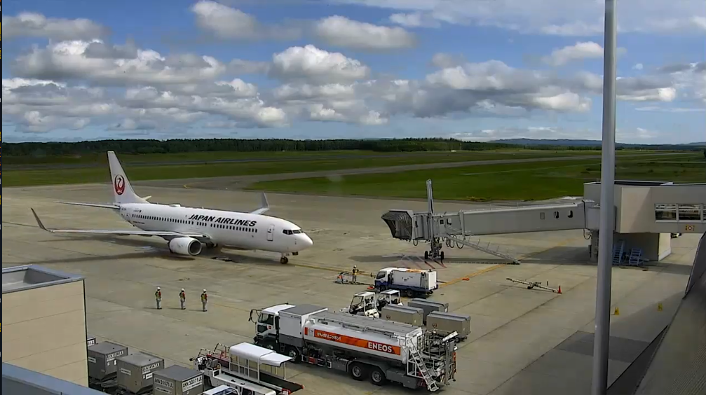
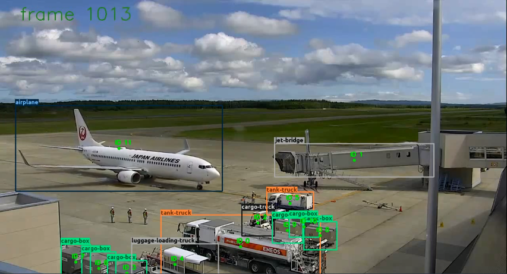

# Airport apron object detector
Detects and tracks key airport apron objects using the custom YoloV4/YoloV4-tiny models trained on security camera airport apron footage.

## Key airport apron objects
- **aircraft**
- **cargo-door** - aircraft doors that are used for (un)loading of the luggage
- **jet-bridge** - enclosed, movable connector which most commonly extendsfrom an airport terminal gate to an aircraft
- **tank-truck** - vehicle that is used for fueling the aircraft or supplying itwith electricity
- **cargo-truck** -  special vehicle that is used for moving the cargo-boxes
- **push-back-truck** -  vehicle  that  carries  out  the  pushback  procedure-  aircraft  is  pushed  backwards  away  from  an  airport  gate  by  externalpower
- **luggage-loading-truck** - vehicle that is used for (un)loading the lug-gage through the cargo-door
- **cargo-box** - container used for storing luggage or other aircraft material
- **basic-truck** - normal car that operates on airport apron

## Example
### Input

### Output

## Setting up

### Download the weights
Firtly you need to download the trained weights of the models using these google drive links:
- YoloV4 : [yoloV4.weights](https://drive.google.com/file/d/1O0ogQtOQNNnsF3vFM_LYnfxafhE7Kc0Z/view?usp=sharing)
- YoloV4-tiny : [yoloV4-tiny.weights](https://drive.google.com/file/d/1GvdJpuoRdGbUmAiwW36HqduMhhoWMrAU/view?usp=sharing)

After the download is complete, place the downloaded weights into the models/yoloV4 and models/yoloV4-tiny respectively.

### Install the requirements
#### For python application
Run:
```
pip install -r requirements.txt  
```
#### For visualization application
You need to have the [Nodejs](https://nodejs.org/en/) installed and then run following in the front_end/my-app folder of the repo:
```
npm install
```
#### Other required tools
- [ffmpeg](https://ffmpeg.org/)


## Usage
### Generating the annotated video and timeline graph
Run in the src folder of the repo:
```bash
python app.py -i <input_video_path> -m <chosen_model> -f <inference_frequency>
```

```
usage: app.py [-h] -i INPUT [-m MODEL] [-f FREQ]

Key object airport apron detector

optional arguments:
  -h, --help            show this help message and exit
  -i INPUT, --input INPUT
                        path to the input video file
  -m MODEL, --model MODEL
                        trained model to be used, options: tiny/yolov4
  -f FREQ, --freq FREQ  inference will be performed only on every n-th frame
                        for speed improvement
```
### Visualizing results
In the front_end/my-app directory of the repo run:
```
npm start
```

Note: you need to generate the required files first by running the python application in order to render the results.

## Test video
If you want to test it out, but don't have footage from airport apron, you can download the example video from here: [test.mp4](https://drive.google.com/file/d/1Han7M5N7_3DXW5FdE0qywkyweT67c0Az/view?usp=sharing)


## Licence
[GNU General Public License v3.0](http://www.gnu.org/licenses/gpl-3.0.html)